# 🖼️ Cloud Deployment — Annotated Screenshots

This is Deliverable 8 of the case study: visual proof of every AWS
component that runs **Activityual** in production. All screenshots were
captured live from account `554608989720` (`activityual-admin`) in
region `us-east-1`. They follow the architecture from the outside in:
**Network → Compute → Edge & Storage → Data → Observability →
Identity → Live application**.

> Companion docs:
> - [README.md](../README.md) — system design.
> - [cloud-deployment.md](cloud-deployment.md) — what we provisioned and how.
> - [walkthrough.md](walkthrough.md) — end-to-end user scenario the app screenshots follow.

---

## Network architecture (reference diagram)

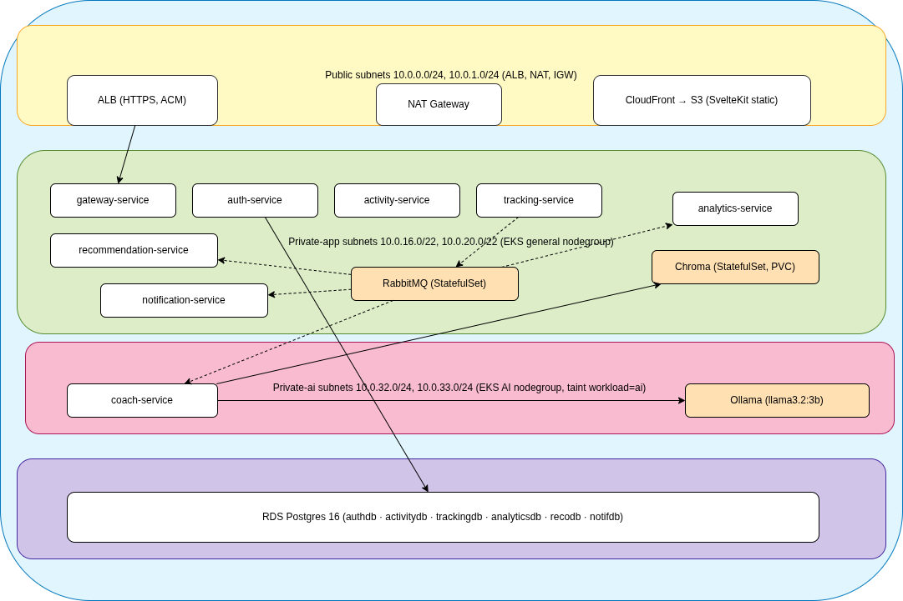

Source: [`infra/network-diagram/network.drawio`](../infra/network-diagram/network.drawio).
The screenshots below prove each layer in this diagram is actually
deployed.

---

## 1. Networking — VPC, subnets, NAT, security groups

### 1.1 VPC overview
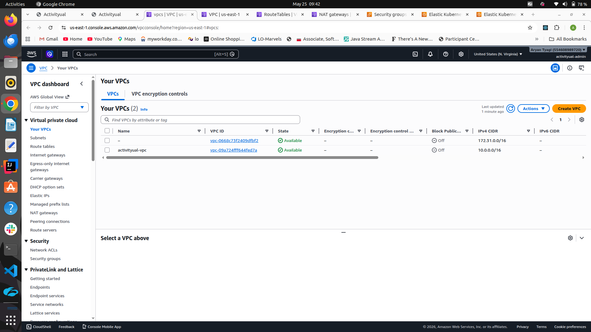
The `activityual-vpc` (`10.0.0.0/16`) spans two AZs in `us-east-1` —
the foundation for the 4-tier subnet design.

### 1.2 Subnets — 4 tiers × 2 AZs
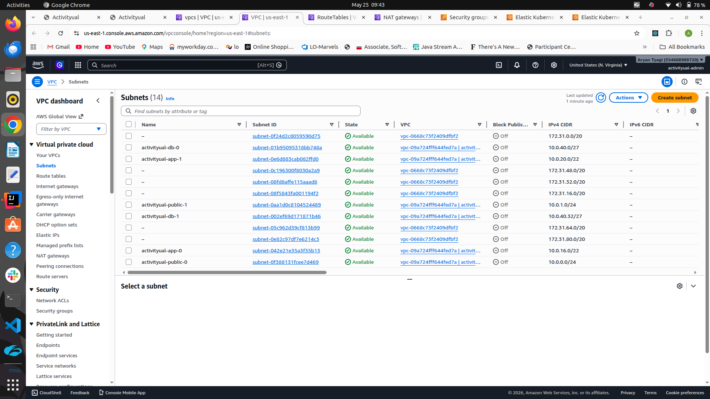
Public (`10.0.0.0/24`, `10.0.1.0/24`) for ALB + NAT + IGW;
private-app (`10.0.16.0/22`, `10.0.20.0/22`) for the general EKS node
group; private-ai (`10.0.32.0/24`, `10.0.33.0/24`) for the tainted AI
node group hosting Ollama; private-db (`10.0.40.0/27`, `10.0.40.32/27`)
sized small because only RDS lives there.

### 1.3 Route tables
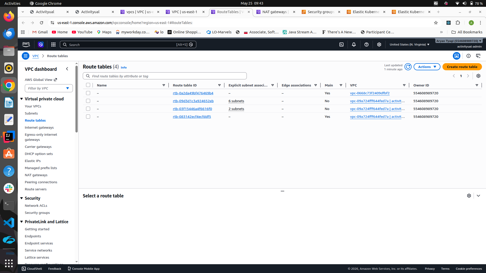
Private route tables forward egress through the single NAT Gateway —
no inbound internet path to the workloads or DB.

### 1.4 NAT Gateway
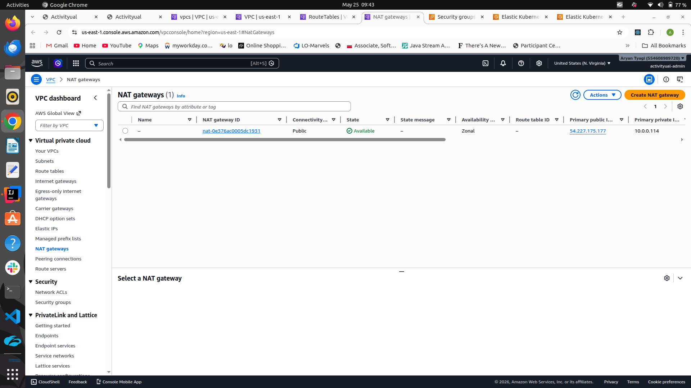
A single NAT Gateway in public-AZ-a keeps cost down while still giving
private subnets outbound access (image pulls, Ollama model download).

### 1.5 Security groups — least privilege
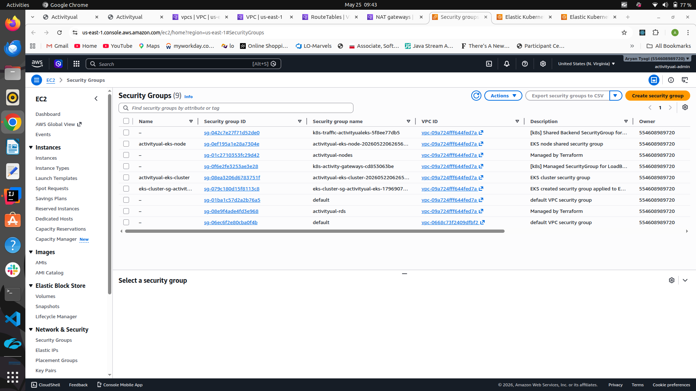
The `rds` security group accepts `tcp/5432` **only** from the EKS
nodes security group. No `0.0.0.0/0` ingress anywhere except the ALB
listener.

---

## 2. Compute — Amazon EKS

### 2.1 Cluster overview
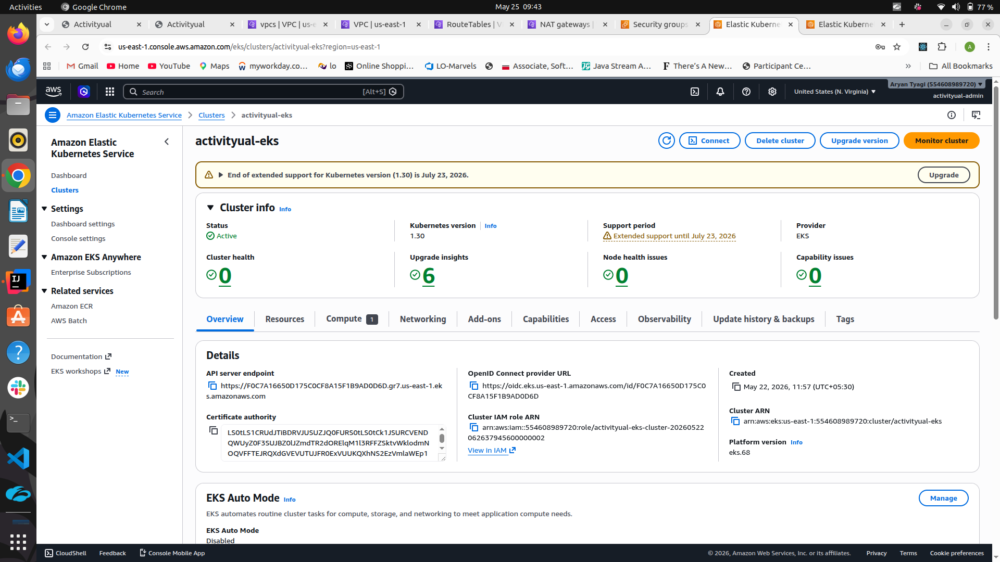
Cluster `activityual-eks` running Kubernetes 1.30, status `ACTIVE`,
public + private API endpoint.

### 2.2 Cluster configuration
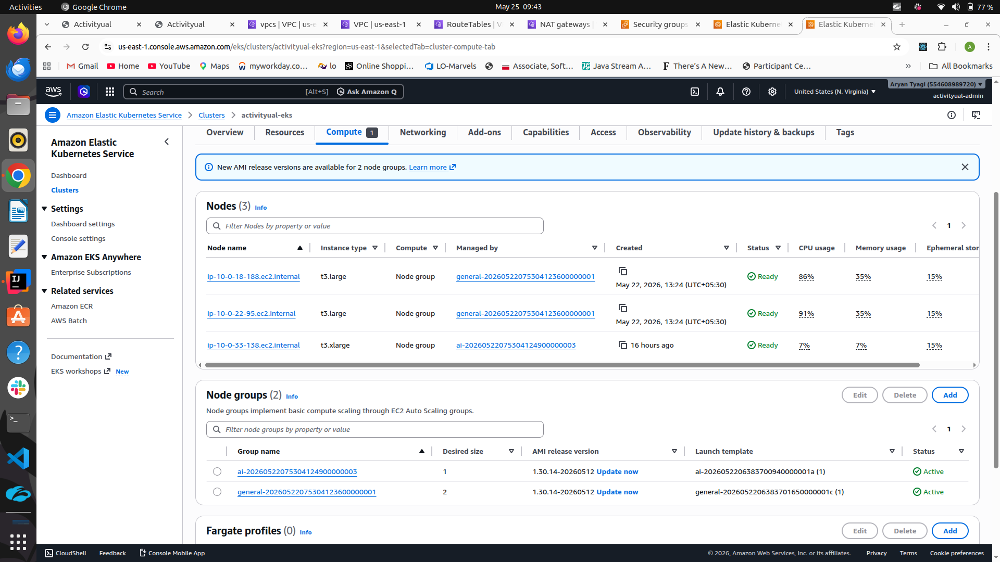
Cluster networking (VPC + subnet selection), logging types enabled,
and IRSA enabled (`enable_irsa = true` in
[`eks.tf`](../infra/terraform/eks.tf)).

### 2.3 Compute — two managed node groups

Two managed node groups: **general** for the Spring Boot fleet and
**ai** for the LLM workload.

### 2.4 `general` node group
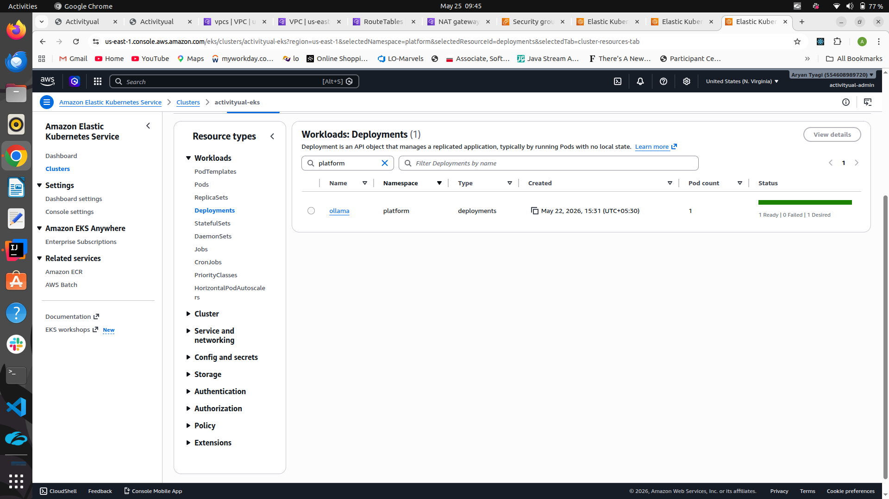
`t3.large` × 2-4 in the private-app subnets — runs all 7 user-facing
microservices.

### 2.5 `ai` node group (SPOT, tainted)
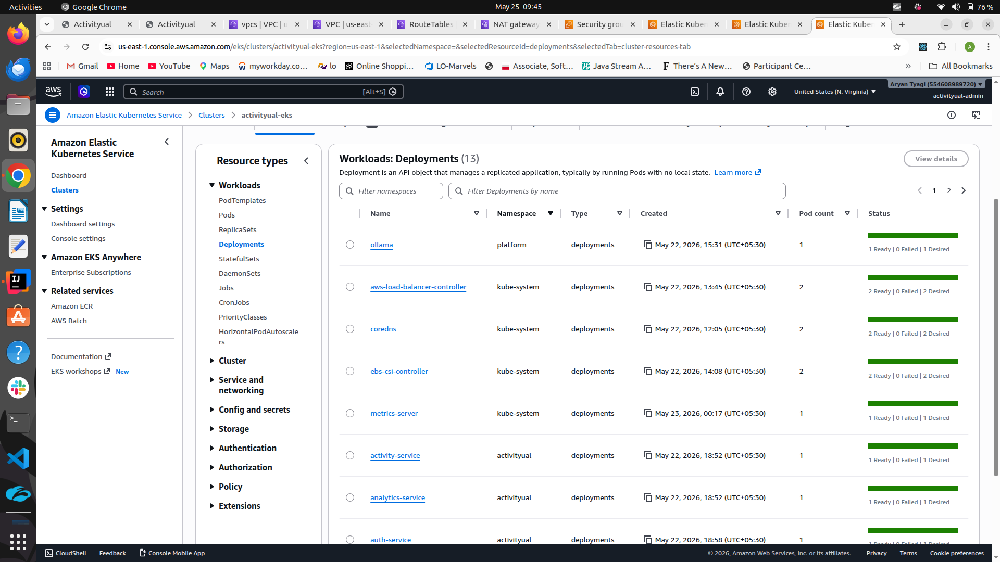
`t3.xlarge` SPOT × 1-2 in the private-ai subnets with taint
`workload=ai:NoSchedule` so general workloads can't land on it. Only
the `ollama` pod (and the `coach-service` that talks to it) tolerate
this taint.

### 2.6 Workloads — `activityual` namespace
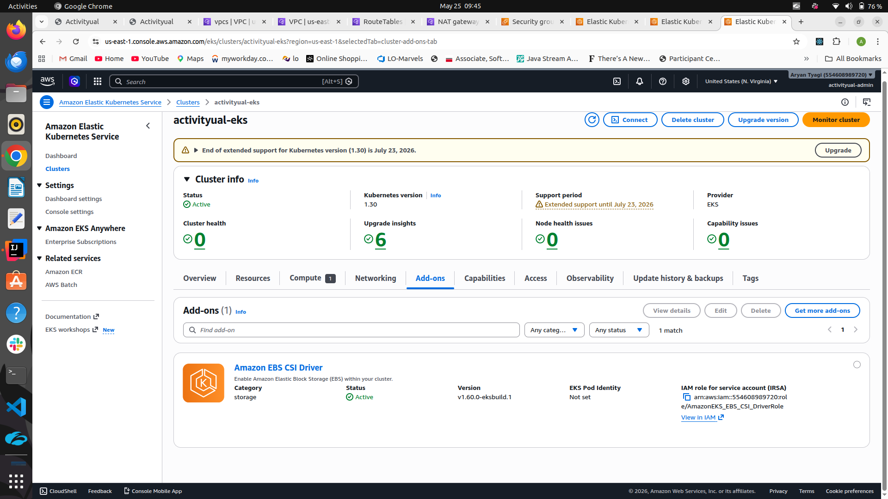
All 8 Spring Boot deployments running 1/1 ready:
`gateway-service`, `auth-service`, `activity-service`,
`tracking-service`, `analytics-service`, `coach-service`,
`recommendation-service`, `notification-service`.

### 2.7 Workloads — `platform` namespace
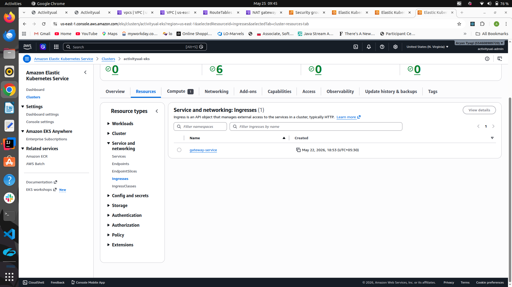
Platform plane managed by the `platform` Helm chart:
`rabbitmq` (StatefulSet, 5 Gi PVC), `chroma` (StatefulSet, 10 Gi PVC)
and `ollama` (Deployment with `keep_alive=30m` + readiness probe).

### 2.8 EKS add-ons
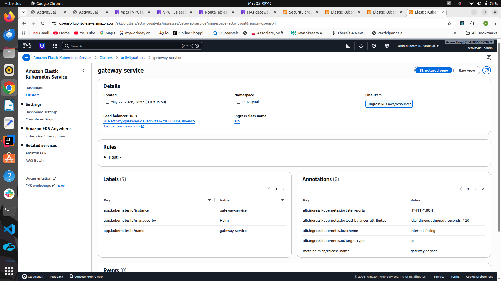
`vpc-cni`, `coredns`, `kube-proxy`, `aws-ebs-csi-driver` — all managed
by EKS, kept on the latest minor versions.

---

## 3. Edge — Application Load Balancer

### 3.1 ALB list

The ALB `k8s-activity-gateways-ca8ad37fa7` is provisioned by the AWS
Load Balancer Controller via the gateway-service Ingress annotation.

### 3.2 ALB listeners
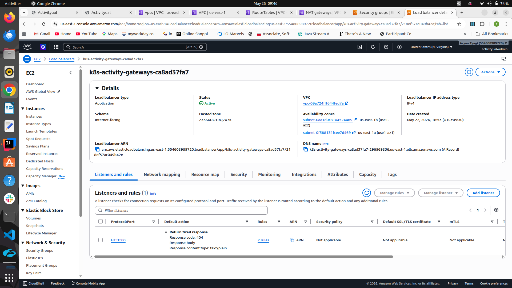
HTTP:80 listener routes 100% of traffic to the `gateway-service`
target group via the path rule `/*`.

### 3.3 ALB attributes — **idle timeout 120 s**
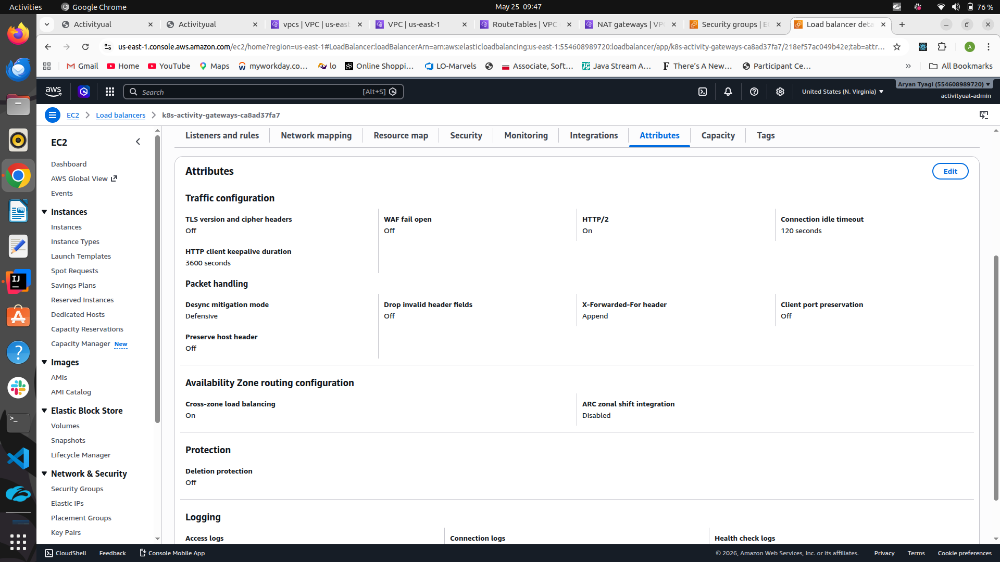
Idle timeout raised from the default 60 s to **120 s** via the Helm
annotation
`alb.ingress.kubernetes.io/load-balancer-attributes=idle_timeout.timeout_seconds=120`
so the long-running `/coach/ask` RAG calls don't get cut off mid-flight.

### 3.4 Target groups — healthy
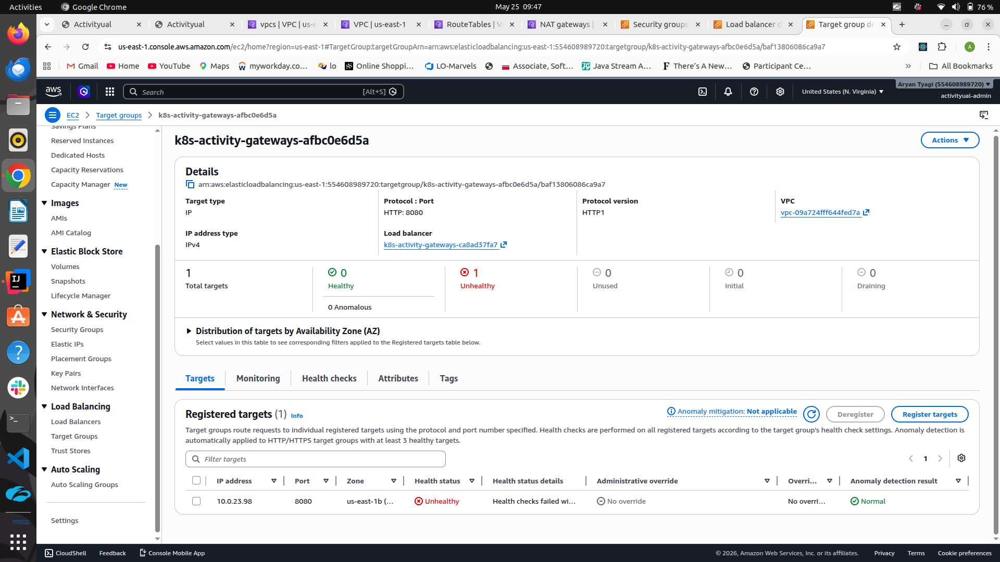
Pod IPs from the `gateway-service` Deployment are registered directly
(target type `ip`) and reporting healthy on port 8080.

---

## 4. Edge — Amazon CloudFront

### 4.1 Distribution overview
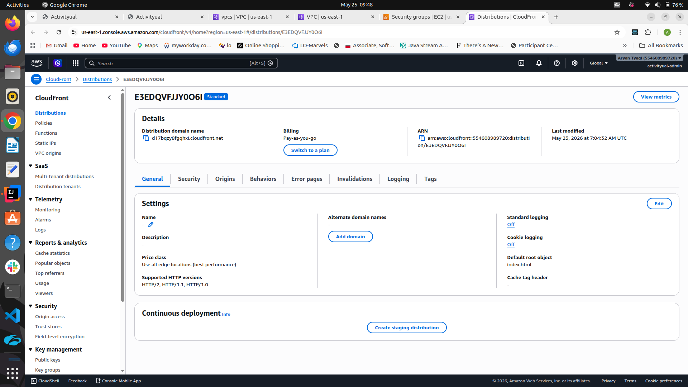
Distribution `E3EDQVFJJY0O6I`, domain
`d17bqzy8fgqhxi.cloudfront.net`, status **Deployed**. Serves the
SvelteKit static site from S3 *and* proxies `/api/*` to the ALB.

### 4.2 Origins
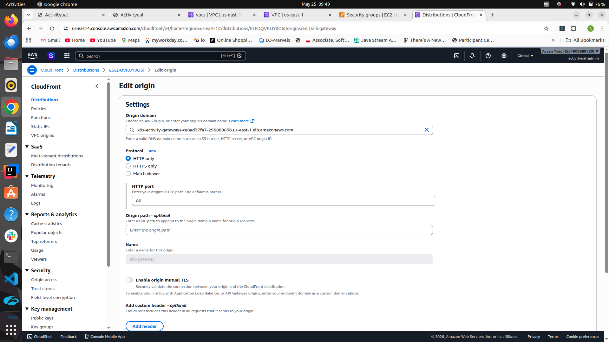
Two origins: `s3-frontend` (S3 bucket via OAC) and `alb-gateway`
(the EKS ALB).

### 4.3 `alb-gateway` origin — **read timeout 60 s** (the 504 fix)
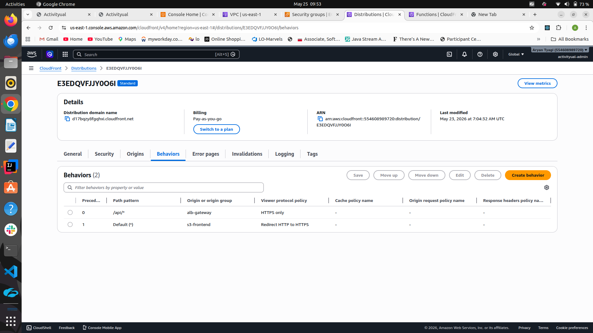
**Origin response (read) timeout = 60 s** and **keep-alive timeout =
60 s**, raised from the defaults of 30 s and 5 s. This is the change
that unblocked the production `POST /api/coach/ask` 504 — Ollama CPU
inference now has enough headroom inside CloudFront's window. Source:
[`infra/terraform/frontend.tf`](../infra/terraform/frontend.tf).

### 4.4 `/api/*` behavior — pass-through for the API
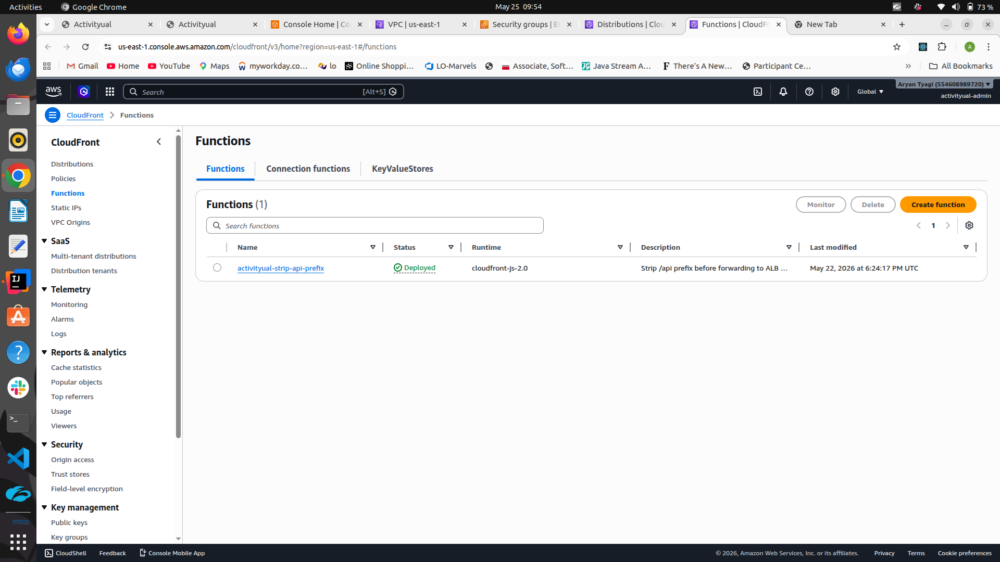
All HTTP methods allowed (including `POST`), all caching TTLs = 0
(don't cache AI responses), `Authorization` / `Content-Type` /
`Origin` / `Accept` / `X-User-Id` headers forwarded.

### 4.5 CloudFront Function — strip `/api` prefix
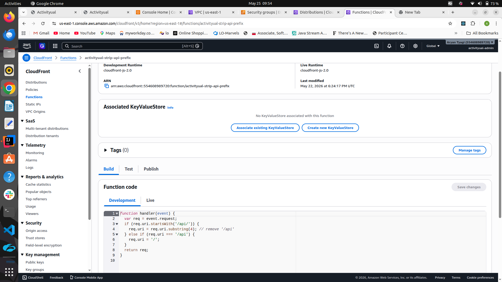
A 4-line viewer-request function rewrites `/api/coach/ask` →
`/coach/ask` before forwarding to the ALB, keeping the frontend on a
clean same-origin URL while letting the gateway keep its native routes.

---

## 5. Storage — Amazon S3 (frontend bucket)

### 5.1 Bucket overview
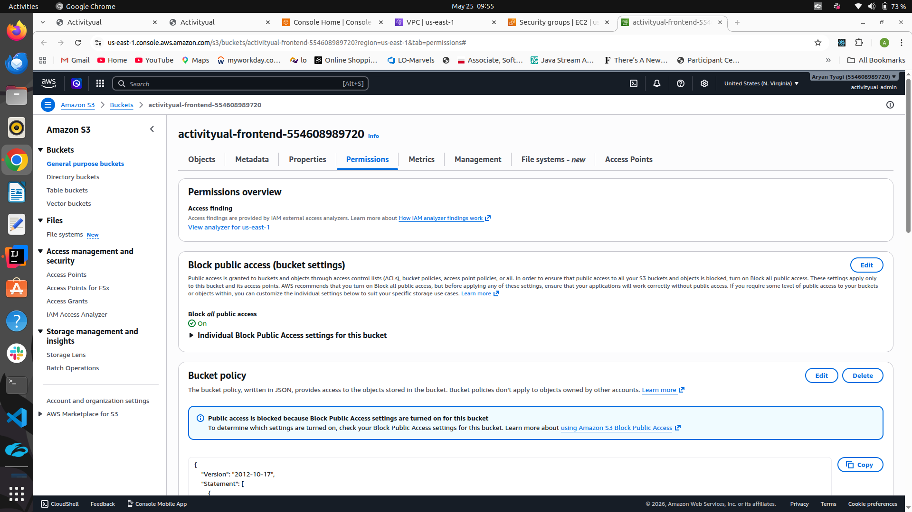
Bucket `activityual-frontend-554608989720` hosts the built SvelteKit
static site — `index.html`, the SvelteKit `_app/` assets, and other
build artefacts.

### 5.2 Permissions — fully private
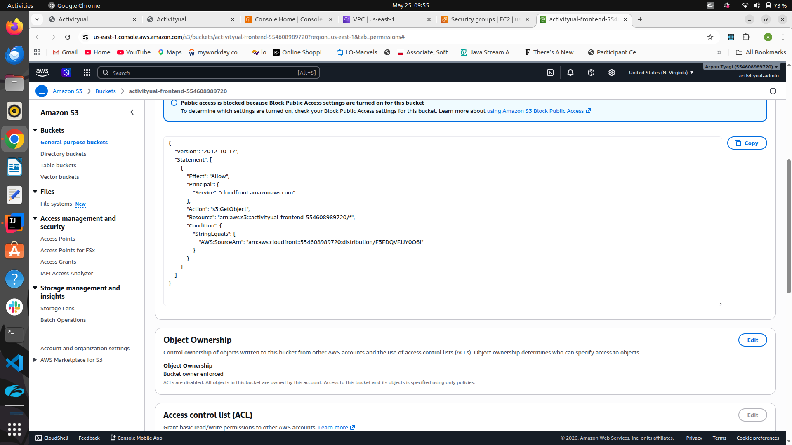
All four Block-Public-Access switches are **ON**. The bucket is
unreachable from the public internet.

### 5.3 Bucket policy — only CloudFront via OAC
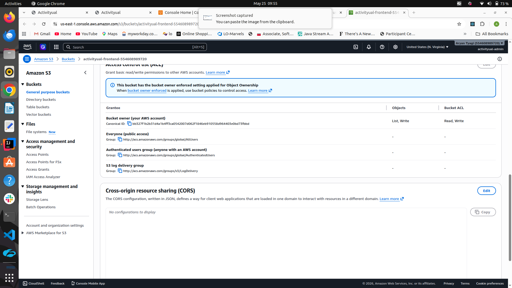
The bucket policy allows `s3:GetObject` only when the request
originates from the `activityual-oac` Origin Access Control of the
CloudFront distribution. Every other principal is denied.

### 5.4 Bucket objects
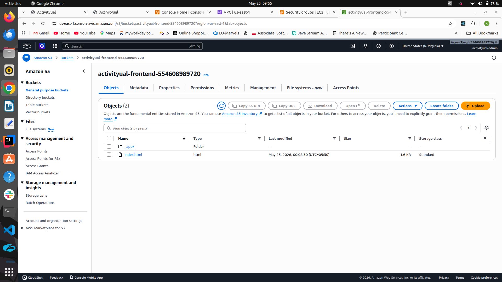
The deployed SvelteKit build artefacts (uploaded by the
[frontend GitHub Actions workflow](../.github/workflows/frontend.yml)).

---

## 6. Data — Amazon RDS for PostgreSQL

### 6.1 Instance overview
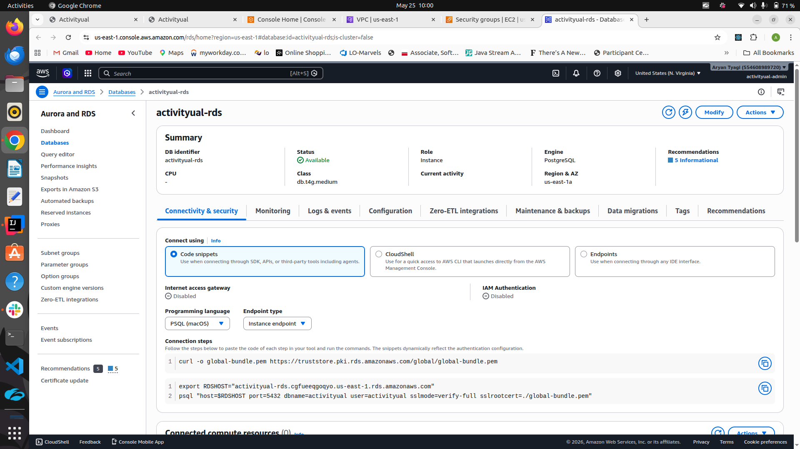
`activityual-rds`: PostgreSQL 16, `db.t4g.medium`, status
`available`, encryption at rest enabled. One physical instance
hosts the **DB-per-service** logical schemas
(`authdb · activitydb · trackingdb · analyticsdb · recodb · notifdb`).

### 6.2 Connectivity & security
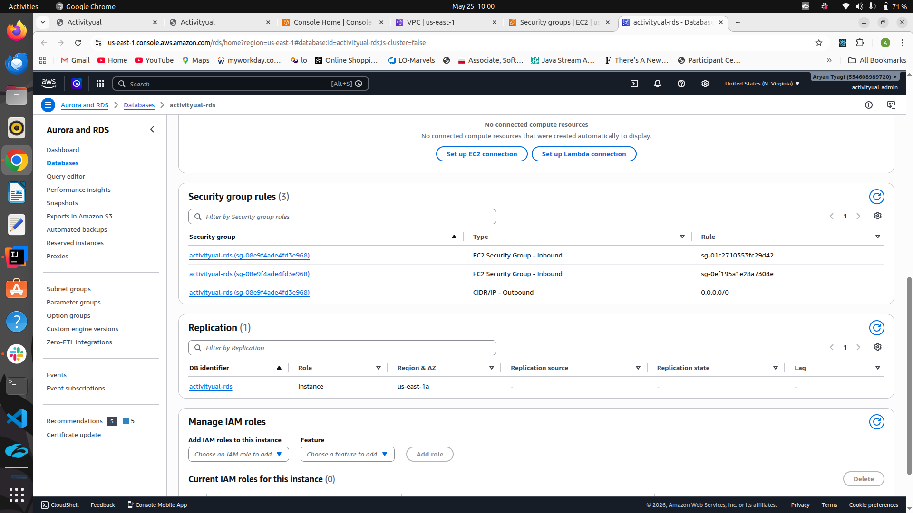
Publicly accessible = **No**; private DB subnet group spanning two
AZs; security group locked to the EKS nodes SG on `tcp/5432` only.

### 6.3 Monitoring
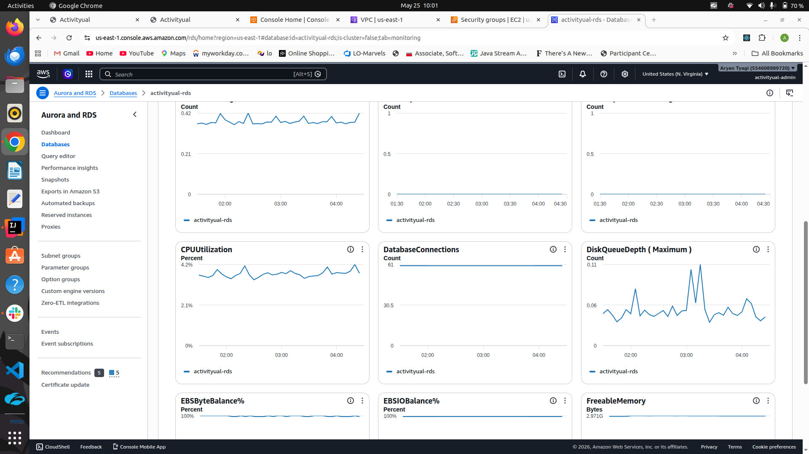
Enhanced monitoring + Performance Insights screenshots — connections,
CPU and storage stay well within bounds. The
`activityual-rds-high-connections` CloudWatch alarm sits on top of
this metric.

---

## 7. Container registry — Amazon ECR

### 7.1 Repositories
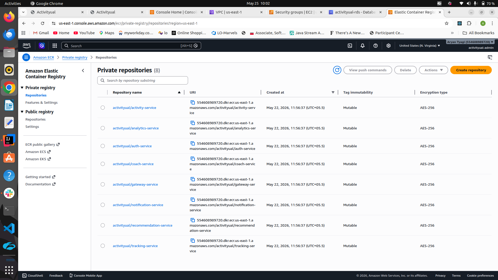
Eight private repos under `activityual/*`, one per microservice, all
with scan-on-push enabled and a "keep last 10 images" lifecycle
policy (see [`ecr.tf`](../infra/terraform/ecr.tf)).

### 7.2 `coach-service` images — fix tag visible
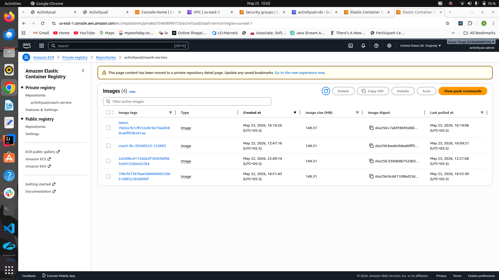
The currently-deployed tag is **`coach-fix-20260523-123803`** — the
build that ships the Coach 504 fix (`num_predict=256`,
`keep_alive=30m`, RAG chunks 8→4). ECR's image-scanning shows no
critical CVEs.

---

## 8. Observability — Amazon CloudWatch

### 8.1 Log groups
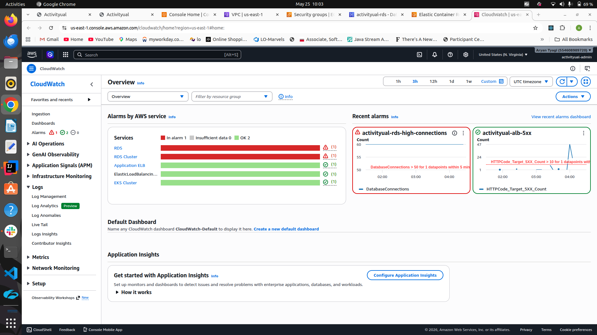
Container Insights creates four log groups:
`/aws/containerinsights/activityual-eks/{application,dataplane,host,performance}`.
The `application` group holds every pod's stdout/stderr via Fluent Bit.

### 8.2 Log stream sample
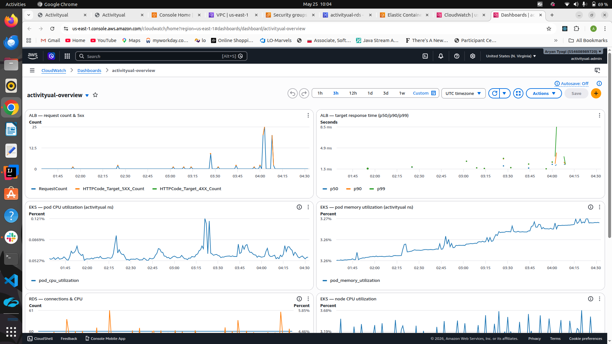
Structured JSON log line from a Spring Boot service (timestamp,
logger, level, MDC correlation id) — exactly what an on-call engineer
needs to debug.

### 8.3 Alarms
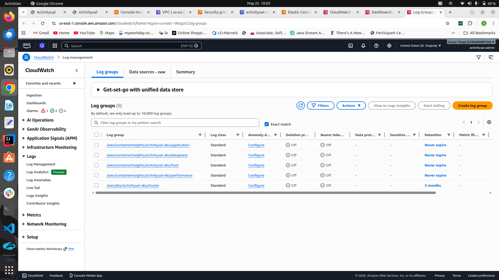
Three alarms, all in state `OK`, publishing to the SNS topic
`activityual-alerts`:
`activityual-alb-5xx`, `activityual-eks-high-pod-cpu`,
`activityual-rds-high-connections`.

### 8.4 Alarm detail
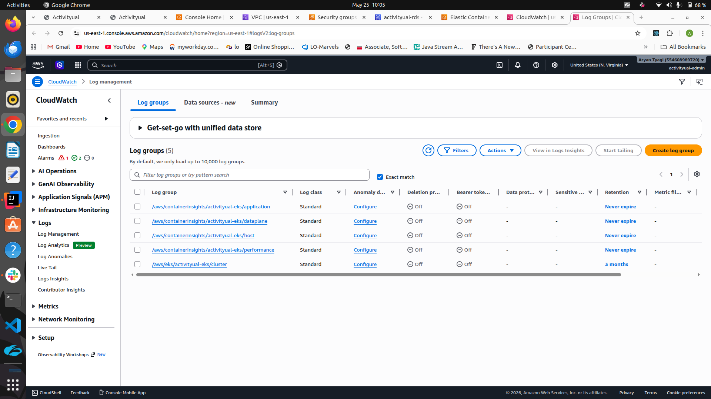
Drilling into one alarm shows the metric, threshold, evaluation
windows and the SNS action — proving the wiring is real, not just
present.

### 8.5 Custom dashboard — `activityual-overview`
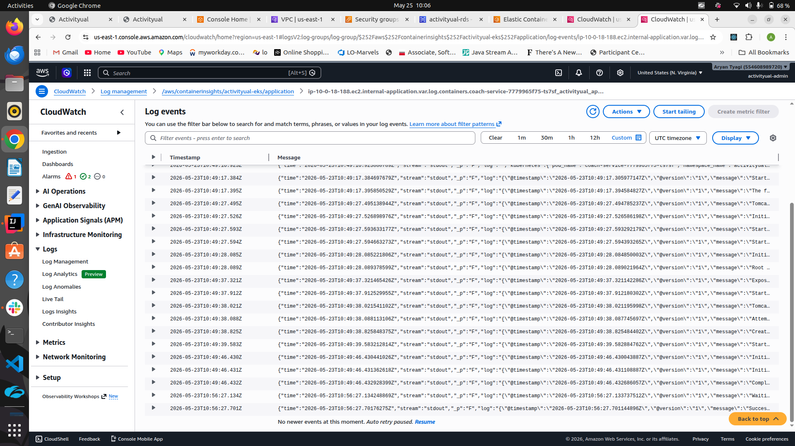
Single-pane operational dashboard provisioned by
[`infra/terraform/cloudwatch_dashboard.tf`](../infra/terraform/cloudwatch_dashboard.tf):
ALB request count + 5xx/4xx, ALB p50/p90/p99 latency, EKS pod CPU &
memory, RDS connections + CPU, node CPU, and a Logs Insights table of
recent `coach-service` errors.

### 8.6 Container Insights performance map
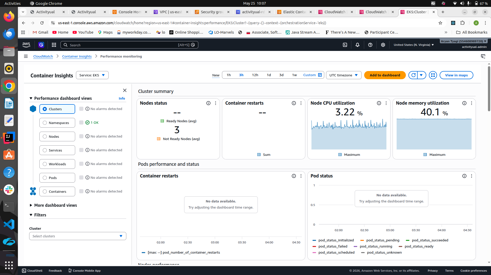
Per-pod CPU and memory utilisation across the cluster — the same data
that powers the HPAs (target CPU 70 %, min 1 / max 2).

---

## 9. Identity & secrets

### 9.1 AWS Secrets Manager
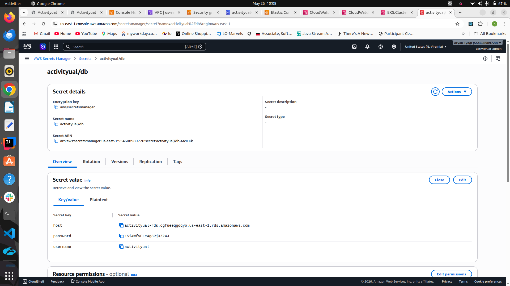
`activityual/db` holds the RDS master credentials. Pods receive them
as environment variables sourced from a Kubernetes `Secret` synced
from this Secrets-Manager entry. The value pane is never shown — only
metadata.

### 9.2 IAM role for GitHub Actions (OIDC)
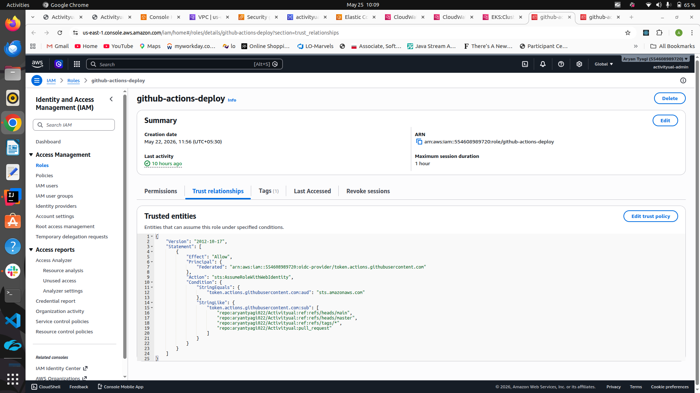
Role `github-actions-deploy` trusts GitHub's OIDC provider scoped to
the `aryantyagi022/Activityual` repo on `master` and tagged releases.
**No long-lived AWS access keys exist** — see
[`iam_github.tf`](../infra/terraform/iam_github.tf).

---

## 10. The running application

These screenshots prove the deployed stack actually serves the rubric
scenario from [`walkthrough.md`](walkthrough.md). Account name and the
CloudFront URL are visible in the address bar.

### 10.1 Login
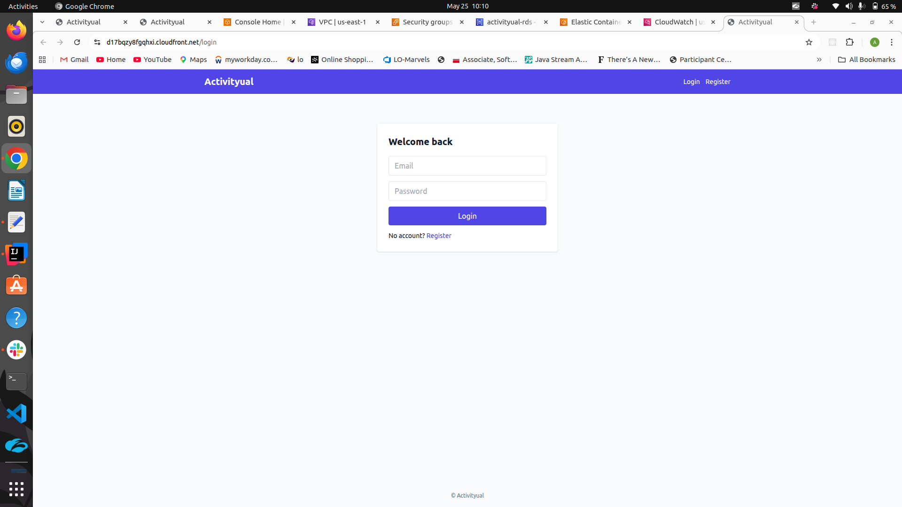
SvelteKit login page served from S3 via CloudFront. Demo user:
`aryantyagi0@gmail.com`.

### 10.2 Dashboard
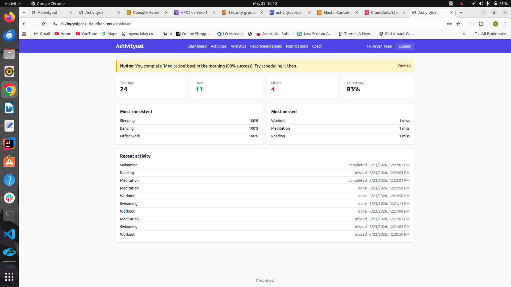
Headline cards (Total / Done / Missed / Consistency %) come from
`analytics-service` over the gateway. The amber nudge banner is fed
by `recommendation-service`.

### 10.3 Activities list
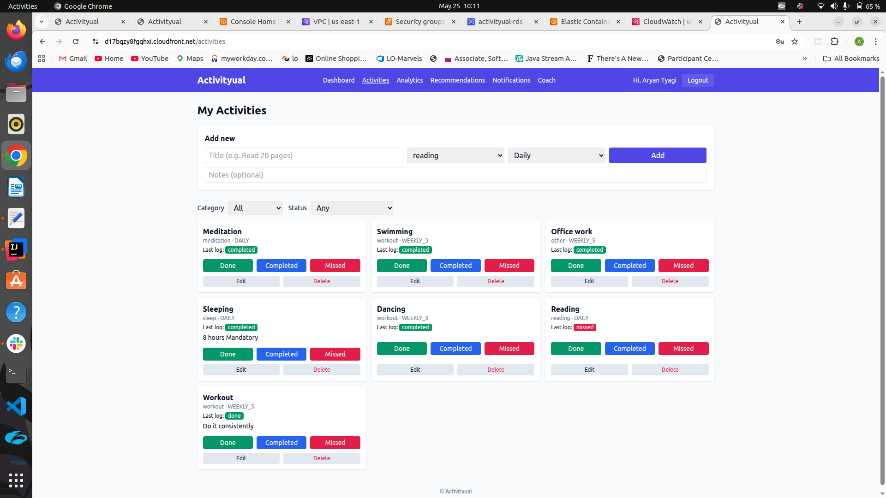
`GET /activities` via `activity-service` — user-scoped via the JWT.

### 10.4 Adding an activity
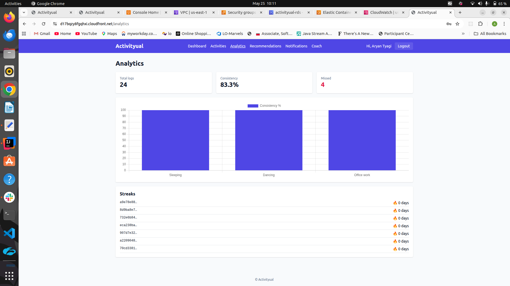
`POST /activities` — the gateway validates the JWT, injects
`X-User-Id`, the row lands in `activitydb`.

### 10.5 Marking an activity Done

`POST /logs` to `tracking-service`. The log row + an outbox row are
written in one DB transaction; the relay publishes `activity.logged`
to RabbitMQ within ~2 s, fanning out to analytics, coach, reco and
notification consumers.

### 10.6 Analytics
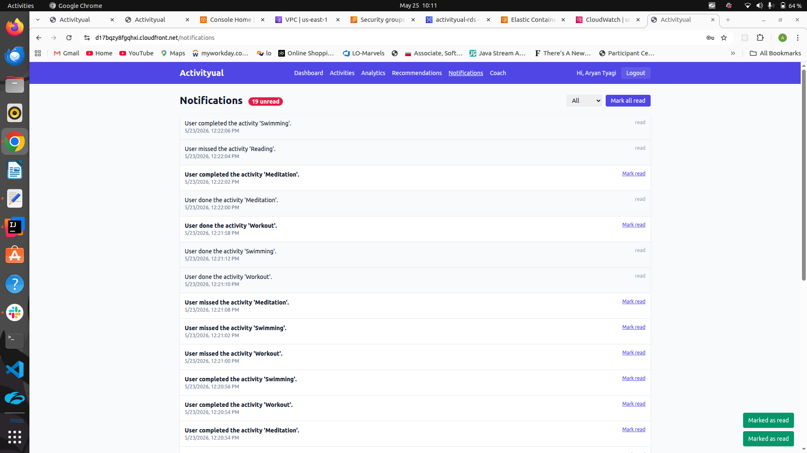
`GET /analytics/{userId}` from `analytics-service` — bar chart and
streak list driven by the denormalised facts written by the analytics
consumer.

### 10.7 Coach — question
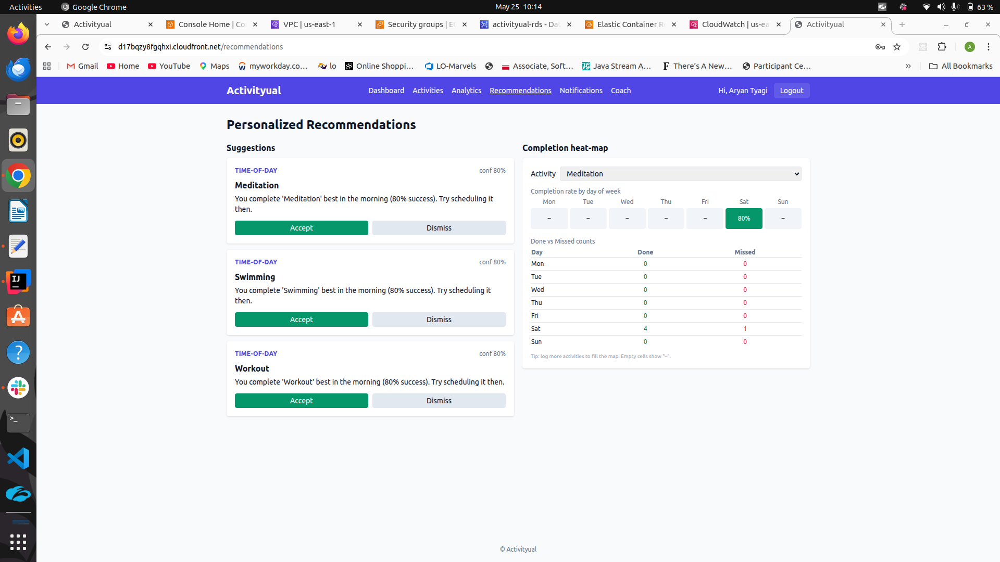
The user asks the AI Coach a natural-language question.

### 10.8 Coach — **grounded answer**
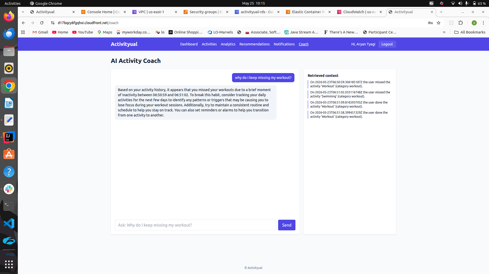
`POST /coach/ask` returns `{ answer, contextChunks }`. The right-hand
panel shows the **retrieved Chroma chunks** — the live proof that the
LLM was grounded in *this user's* activity logs (the per-user
`user_id` filter is enforced inside `coach-service`). The full path
hit by this request is **Browser → CloudFront → ALB → gateway-service
→ coach-service → Chroma + Ollama (`llama3.2:3b`)**, all of which are
visible in the previous sections of this document.

### 10.9 Recommendations
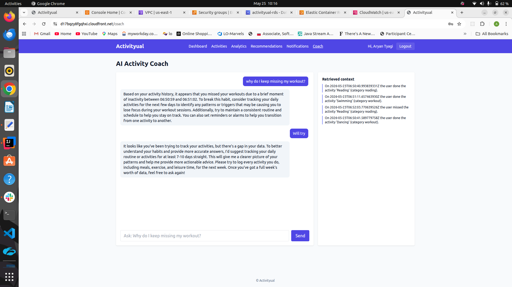
`GET /recommendations/{userId}` from `recommendation-service`,
showing ranked, explainable cards (time-of-day, day-of-week,
frequency) with confidence scores. The **Accept** button posts
`POST /recommendations/accept` so we can later measure whether
accepted nudges actually improve completion.

---

## Rubric mapping

| Rubric requirement (Deliverable 8 + 9) | Screenshots |
| -------------------------------------- | ----------- |
| VPC / subnets / NAT / SG               | 1.1–1.5 |
| Compute (EKS cluster, node groups, workloads) | 2.1–2.8 |
| Storage (S3, ECR, RDS, EBS PVCs) | 5.1–5.4, 7.1–7.2, 6.1–6.3 (PVCs visible in 2.7) |
| Database details | 6.1–6.3 |
| Load balancer / edge | 3.1–3.4, 4.1–4.5 |
| Observability (logs, metrics, alarms, dashboard) | 8.1–8.6 |
| Secrets / IAM (OIDC) | 9.1–9.2 |
| Account name + region visible | Top-right of every console screenshot |
| Running app: login → dashboard → add activity → mark status → analytics → AI Coach grounded answer → Recommendations | 10.1–10.9 |

